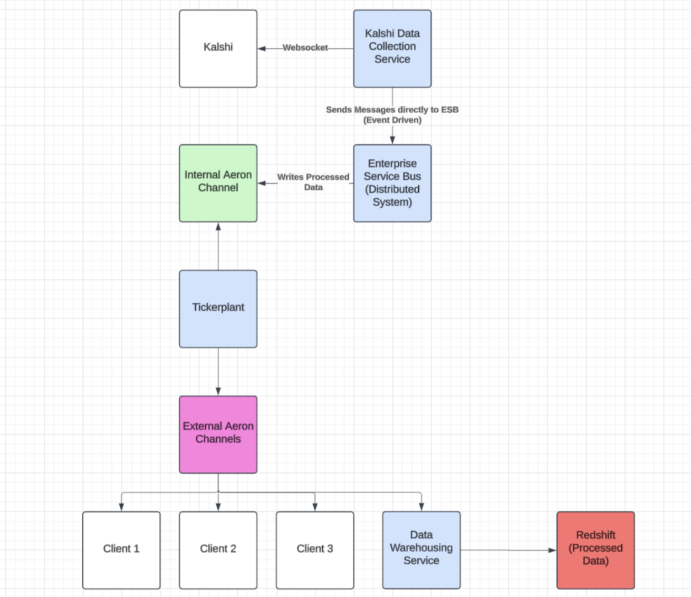

# Final Report

## Members

- [Anushree Atmakuri](https://www.linkedin.com/in/anushree-atmakuri-072968243/) (aa127@illinois.edu)
- [Brian Eide](https://www.linkedin.com/in/brian-eide/) (eide2@illinois.edu)
- [Julie Lima](https://www.linkedin.com/in/julielima/) (julie11@illinois.edu)
- [Akul Sharma](https://linkedin.com/in/akulsharma1) (akuls2@illinois.edu)

## Introduction
Real-time market data feeds and stored historical market data are both crucial for ensuring that trading firms can make informed decisions when participating in the market. Real-time data feeds allow for automated trading strategies, risk monitoring, and live-updating dashboards. Historical data is needed for developing trading strategies, creating back-testing libraries, and performing post-trade analysis. Our team has developed the infrastructure to provide this market data to clients for Kalshi, an event contracts exchange, which does not supply robust historical market data.

### What is Kalshi?
Kalshi is a U.S.-based exchange that allows users to trade financial contracts on the outcome of future events. Users are able to place trades on almost anything – from elections, to the weather in specific cities, to future Oscars winners. These contracts function like stock tickers, where the price reflects market sentiment; thus, Kalshi is often referred to as a “prediction market”. For example, a contract predicting that a particular politician will win an election might trade at $0.80 if they are expected to win by a large margin, while the opposing outcome trades at $0.20. Once the relevant data is released, the contract will settle either “Yes” or “No”. As a result of this type of binary trading, the prices of the two sides always sum to $1.

Kalshi aims to democratize access to event-driven markets, giving participants from all backgrounds the ability to gain insights into, speculate on, or hedge against a wide range of future events. The exchange provides continuously updated pricing data on the contracts traded on its platform. This data includes contract prices, volumes, open interest, and settlement information. Traders, analysts, and researchers rely on this data to assess market sentiment, evaluate probabilities, and track developments in real time.

## Overview
Our infrastructure is centered around an Enterprise Service Bus (ESB), acting as the “brain” of the data collection system. At a high level, the ESB facilitates communication and integration between the different entities in our system. As a whole, our system receives messages containing Kalshi market data, processes them, and then sends the processed data to interested clients.

To get market data, we connect to the Kalshi API with a custom WebSocket client. We subscribe to an array of markets for three types of updates: orderbook deltas, trades, and “ticker”.

As stated before, our service running the WebSocket client sends data messages through the ESB orchestrator to the data processor, which processes them. Processing updates our internal copies of the order books, which lets the processor know if our custom “top of book” message type should be sent. Once the processor decides what should be published, the messages are sent to the tickerplant. The tickerplant then publishes each message to the appropriate data feed, where interested clients are able to connect and read from.

One such interested client is our market data recorder, which receives the real-time market data from the tickerplant’s data feeds and writes it to an Amazon Redshift data warehouse. Our system also includes a historical data fetcher to pre-populate our data tables with past market data from Kalshi.

## Terminology

Contract - an agreement between two counterparties to transfer money based on the outcome. On Kalshi, $1 is awarded to the counterparty who had the correct position on the outcome of the event contract.

Tickerplant - a common software (or even hardware) system in HFT that handles the dissemination of massive streams of financial data in a timely manner

Orderbook deltas - a message type that describes an update to the state of an order book. On Kalshi, the message provides the market ticker, the price level that was modified, how much liquidity was added/removed, and the side (yes/no) that was modified.

Trades - a message type which states that a trade of some contract occurred. Contains metadata like the timestamp, the price at which the trade occurred, which side the user took, etc.

Ticker - a message type that gives a summary of the market’s latest state. It includes the last traded price, the best bid and offer, open interest, and volume data.

## Tools and Technologies

We used various tools and technologies for our project. We wanted to emphasize the low-latency requirement, so many of our technologies are HFT-related software.

For our ESB, we are using Aeron Cluster, a distributed system utilizing the Raft consensus algorithm for leader election, fault tolerance, and replication. Aeron clusters also have channels through which services can communicate in a publish/subscribe (pubsub) fashion. We specifically chose Aeron for its low-latency properties, as it is able to receive the messages, process them, and send them to the tickerplant with <100 microsecond latency.

We are using Amazon Redshift for our data warehousing. There can be hundreds of thousands of trade messages on a given day, so a warehouse like Redshift can handle this scale effectively for an affordable price.

Because the Kalshi API uses the WebSocket protocol for streaming live data, we use a WebSocket connection to receive all live market updates. Due to the way that the API requires authentication through headers, it was hard to find a Java WebSocket library that could support this specific need. It ended up being easier to write our own lightweight WebSocket client, so we used our custom-made client to interface with the API.

## Components

### Historical Market Data Fetcher

The historical market data fetcher gathers past market data that is available from Kalshi’s API. This data is mostly limited to historical trades data, but it is still useful to have a streamlined way to fetch data that predates our recordings. We can also use this in the future to ensure that our process from the real-time market data listener to the real-time data storage isn’t missing trades or executing too slowly.

The fetcher uses Java to interact with Kalshi’s REST API. Retrieving years’ worth of data is extremely expensive, so we opted to only write this data to Redshift. Our code for the historical data fetcher, including our Redshift connection code, processing, and Kalshi data fetcher, is in the [historicalDataFetcher](https://gitlab.engr.illinois.edu/ie421_high_frequency_trading_fall_2024/ie421_hft_fall_2024_group_08/group_08_project/-/tree/main/src/main/java/edu/illinois/group8/historicalDataFetcher) subdirectory.

### Real-Time Market Data Listener

The real-time market data listener connects to the Kalshi API via a custom WebSocket client ([KalshiSystem.java](https://gitlab.engr.illinois.edu/ie421_high_frequency_trading_fall_2024/ie421_hft_fall_2024_group_08/group_08_project/-/blob/main/src/main/java/edu/illinois/group8/KalshiSystem.java)). It collects information from Kalshi’s `trade`, `ticker`, and `orderbook_delta` channels, sending this data to the Enterprise Service Bus through a custom communication orchestrator ([cluster/ClientClusterOrchestrator.java](https://gitlab.engr.illinois.edu/ie421_high_frequency_trading_fall_2024/ie421_hft_fall_2024_group_08/group_08_project/-/blob/main/src/main/java/edu/illinois/group8/cluster/ClientClusterOrchestrator.java)).

### Enterprise Service Bus

As stated previously, our overall architecture is centered around an Enterprise Service Bus (ESB) acting as the brain of our system. Below is a high-level diagram of this architecture.

Our system has to handle extremely high loads (potentially thousands of updates being recorded and processed per second), so we built it on top of an Aeron Cluster. The ESB receives messages from the real time market data listener and handles the message passing between the different entities in our system.

The ESB architecture and business logic was purposely designed to be abstracted away from clients who may want to connect to it. For example, the ESBClusterCommunicationOrchestrator class ([cluster/ESBClusterCommunicationOrchestrator.java](https://gitlab.engr.illinois.edu/ie421_high_frequency_trading_fall_2024/ie421_hft_fall_2024_group_08/group_08_project/-/blob/main/src/main/java/edu/illinois/group8/cluster/ESBClusterCommunicationOrchestrator.java)) allows services like the Tickerplant to send or receive data through Aeron Channels, without having to manage the details of setting up the pubsub architecture or dealing with cluster node leaders.

### Data Processor

The data processing itself is done in [esb/DataProcessor.java](https://gitlab.engr.illinois.edu/ie421_high_frequency_trading_fall_2024/ie421_hft_fall_2024_group_08/group_08_project/-/blob/main/src/main/java/edu/illinois/group8/esb/DataProcessor.java), which receives the raw Kalshi API data from the real-time market data listener (through the ESB orchestrator) then classifies the message and cleans/formats it based on its type.

Furthermore, the data processor maintains an up-to-date order book for each subscribed symbol. Upon detecting an updated BBO, the data processor creates an additional top-of-book message for the respective symbol.

Each formatted message is then published to our system’s internal Aeron channel, once again handled by the ESB.

### Tickerplant

The tickerplant ([esb/Tickerplant.java](https://gitlab.engr.illinois.edu/ie421_high_frequency_trading_fall_2024/ie421_hft_fall_2024_group_08/group_08_project/-/blob/main/src/main/java/edu/illinois/group8/esb/Tickerplant.java)) is responsible for receiving all of the formatted messages from the internal Aeron channel and sending them to clients. To do this, we opted to create a multicast Aeron channel for each stream type (i.e. trades, top-of-book, open interest, etc.) so that our system supports many subscribed clients. This design also maintains market integrity by ensuring all clients receive the same data at the same time. The tickerplant categorizes each message received and publishes it to the appropriate channel(s).

### Real-Time Data Storage

Our system also has a subscriber to the tickerplant that records real time data to the AWS Redshift data warehouse. This client simply takes every message that the tickerplant sends and writes them all to the data warehouse. Because the client subscribes to Kalshi’s native message types (`orderbook_snapshot`, `orderbook_delta`, `trade`, `ticker`), we end up with a full history of all the raw data we received. This is very useful because if we have a new way we would like to process and save data, we can retroactively apply it to old raw data.

## Demo Video

https://drive.google.com/file/d/1o5qYAFJFuklDwqu1LvT3_zN3f_tN2OL_/view?usp=sharing

## How to Run
1. Clone the repository. 
2. Put your Kalshi API key file in the keys directory. 
3. Edit `docker-compose.yml` line 67 to point to your key file in place of `<KEYDIRHERE>`. 
4. Create a `.env` file with fields `DB_USER` and `DB_PASSWORD` with your Redshift database credentials. 
5. Verify you have Docker installed and then run `docker-compose up --build`

## Future Work

Currently, we are using Unicast for all Aeron channels which is inefficient and tough to code with. This is due to the fact that Multicast with Docker Bridges on MacOS doesn’t work properly; the only way to fix this is by deploying on Linux instead. We eventually plan to deploy our services on a K8s cluster running Linux which should fix our multicast problem. We purposely architected our codebase with layers of abstraction that allow us to switch from Unicast to Multicast endpoints easily.

In the future, we can improve latency for the data storage by writing to an in-memory database first and then batch writing to the data warehouse. Currently, all trades are written to redshift individually which has extremely high latency.

Because our WebSocket client is custom-made to be lightweight, it is lacking some features. For example, the Kalshi API documentation mentions that it uses the WebSocket protocol’s standard ping/pong frames (heartbeat), which we have not yet implemented. This is something we would like to implement to ensure a reliable connection.

