# Current And Planned Architecture

This note compares the repository as it exists now with the old block diagram in
`diagram.png` and the five implementation plans in the parent coursework
directory.

## Comparison Summary

The old diagram is still directionally correct for the original live path:
Kalshi feeds a data collection service, the ESB processes messages, an internal
Aeron channel feeds the tickerplant, and external Aeron channels serve clients
and storage.

The current codebase has expanded that simple path:

- `Kalshi Data Collection Service` now maps to `KalshiSystem`,
  `KalshiWrapper`, `KalshiWebSocketClient`, and `ClientClusterOrchestrator`.
- `Enterprise Service Bus` now maps to Aeron Cluster nodes running
  `ESBClusteredService`, `DataProcessor`, `KalshiCanonicalParser`,
  `OrderBookStateManager`, and the internal canonical bus.
- `Tickerplant` still exists, but it now routes by `stream_name` through
  `StreamRegistry` instead of hardcoded message offsets.
- `External Aeron Channels` now mean Aeron stream IDs 10-19 on the configured
  external channel. They are protocol stream IDs, not Kalshi contract IDs.
- `Data Warehousing Service -> Redshift` has been removed from the current
  source tree and replaced by DB-primary storage plus file/object recording:
  `raw_ws_events` for accepted websocket payloads, `canonical_events` for
  normalized events, `raw_rest_responses` for historical REST response bodies,
  and recording files only for capture/offline/debug/export workflows.
- New current modules not shown in the old diagram include ingress envelopes,
  raw-ingest replay, REST historical backfill with raw REST capture, stream
  recording, source-agnostic featureplant templates,
  stream tap inspection, Prometheus/Grafana, and hot-path profiling.

Plan status from the markdowns:

| Plan | Current state | Where remaining planned modules belong |
| --- | --- | --- |
| `01_core_backend_implementation_plan.md` | Mostly represented in code: config, ingress envelopes, canonical events, parser, order book state, source watermark snapshots, basic cluster recovery snapshot payloads, stream registry, file/object recording, REST backfill, raw replay, Docker profiles, docs, and metrics hooks. | Remaining hardening stays inside the core backend: automated fresh snapshot reload/live recovery, object-store backfill, binary serialization experiments, and WebSocket reconnect/subscription restore reliability. |
| `02_feature_plant_basic_implementation_plan.md` | Initial `feature` package exists: source-agnostic canonical envelope input, DB-backed default input, recording/Aeron sources, fair-polled live stream subscriptions, a feature runtime, bounded output buffer, and BBO/ticker/trade templates. | Add persistent feature outputs, richer stateful modules, and a query/export layer that can consume buffered feature outputs from live or historical sources. |
| `03_standard_frontend_integration_plan.md` | The old `IntegrationGatewayServer` path has been removed; a current frontend adapter HTTP service and lightweight chart demo expose datafeed/search/history/quotes/health/metrics endpoints. | Production frontend work should add durable query backing, WS/SSE streaming, replay controls, and frontend hardening behind the feature/query boundary. |
| `04_basic_instrumentation_plan.md` | Partially implemented: `BackendMetrics`, metrics catalog, cached hot-path metric handles, recorder/streamtap metrics endpoints, feature module metrics, Prometheus, Grafana, and profiling CLI. | Add explicit data-quality events, trace sampling, and broader alert rules around the future feature and semantic layers. |
| `05_semantic_feature_plant_ontology_pricing_plan.md` | Not implemented in source packages today. | Add a downstream semantic/pricing service that consumes canonical streams, feature streams, market metadata, replay, and quality/staleness indicators. |

## Diagram 0: Legacy Baseline Codebase

This diagram treats `1181b6010da1d53d6cff073c07ff351cb57d313e` as the
baseline, before the newer work on the legacy code. At that point the codebase
already matched the old block diagram fairly closely: Kalshi ingestion fed an
Aeron Cluster ESB, the ESB normalized messages onto an internal Aeron stream,
and the tickerplant routed those formatted messages to stream-specific Aeron
publications.

```mermaid
flowchart LR
  classDef source fill:#fff4d6,stroke:#9a6b00,color:#1f1f1f;
  classDef legacy fill:#eef3ff,stroke:#315b7c,color:#102033;
  classDef bus fill:#e8f7ee,stroke:#2d6a4f,color:#102033;
  classDef storage fill:#f5e8ff,stroke:#6d4c86,color:#102033;
  classDef external fill:#f7f7f7,stroke:#555,color:#102033;
  classDef optional fill:#fff7ed,stroke:#9a6b00,color:#102033,stroke-dasharray: 5 5;

  KALSHI0["Kalshi API<br/>REST + WebSocket"]:::source

  subgraph Collect0["Kalshi Data Collection Service"]
    KS0["KalshiSystem<br/>KXHIGHCHI market discovery<br/>subscribes trade, ticker, orderbook_delta"]:::legacy
    KW0["KalshiWrapper<br/>signed REST wrapper<br/>markets, trades, orderbook, series"]:::legacy
    WS0["KalshiWebSocketClient<br/>custom WebSocket client<br/>type switch + single book sequence check"]:::legacy
    CCO0["ClientClusterOrchestrator<br/>Aeron Cluster ingress client"]:::bus
  end

  KALSHI0 -->|REST market discovery| KW0
  KS0 --> KW0
  KW0 --> WS0
  KALSHI0 -->|raw WS JSON| WS0
  WS0 -->|accepted trade, ticker, book JSON| CCO0

  subgraph ESB0["Enterprise Service Bus / Aeron Cluster"]
    CM0["ClusterMain<br/>MediaDriver + Archive + ConsensusModule<br/>ClusteredServiceContainer"]:::bus
    ECS0["ESBClusteredService<br/>leader-only onSessionMessage"]:::bus
    ORCH0["ESBClusterCommunicationOrchestrator<br/>internal pub/sub + char-keyed external streams"]:::bus
    DP0["DataProcessor<br/>legacy formatter + order book state<br/>emits top-of-book"]:::legacy
    MSG0["messages/*<br/>Trade, Ticker, Snapshot, Delta"]:::legacy
    INTERNAL0["Internal Aeron stream<br/>StreamIDs.INTERNAL_IDX = 3"]:::bus
    TP0["Tickerplant<br/>polls internal stream<br/>routes by JSON type char"]:::legacy
  end

  CCO0 -->|cluster ingress| ECS0
  CM0 --> ECS0
  ECS0 --> ORCH0
  ECS0 --> DP0
  DP0 --> MSG0
  DP0 -->|formatted JSON via orchestrator| INTERNAL0
  INTERNAL0 --> TP0

  subgraph Streams0["External Aeron Streams"]
    TRADE0["T trade stream<br/>ID 0"]:::bus
    TOB0["K top-of-book stream<br/>ID 1"]:::bus
    BOOK0["D/S book events stream<br/>ID 2"]:::bus
    TICKER0["R ticker stream<br/>ID 4"]:::bus
    OI0["O open-interest stream<br/>ID 5"]:::bus
  end

  TP0 --> TRADE0
  TP0 --> TOB0
  TP0 --> BOOK0
  TP0 --> TICKER0
  TP0 --> OI0

  subgraph Consumers0["Legacy Consumers And Storage"]
    GRID0["MarketGridDemo<br/>demo Aeron client<br/>started by ESB service"]:::external
    STORE0["TradeDataStorage<br/>trade-stream Redshift subscriber<br/>thread present but disabled in ESB startup"]:::optional
    LISTENER0["AeronListener + BatchProcessor<br/>separate batch storage listener"]:::optional
    DAO0["MessageDAO<br/>placeholder DAO methods"]:::storage
    REDSHIFT0["Amazon Redshift / RDS-era storage<br/>Trades and master tables"]:::storage
  end

  TRADE0 --> GRID0
  TOB0 --> GRID0
  TRADE0 -.-> STORE0
  STORE0 -.-> REDSHIFT0
  TRADE0 -.-> LISTENER0
  LISTENER0 -.-> REDSHIFT0
  DAO0 -.-> REDSHIFT0

  subgraph Historical0["Historical Backfill"]
    HF0["HistoricalFetcherRunner<br/>HistoricalDataFetcher + ThrottlingManager"]:::legacy
    HDP0["historicalDataFetcher.DataProcessor<br/>REST data to Redshift tables"]:::legacy
  end

  KALSHI0 -->|REST trades, events, series| HF0
  HF0 --> HDP0
  HDP0 --> REDSHIFT0
```



## Diagram 1: Current Codebase

```mermaid
flowchart LR
  classDef source fill:#fff4d6,stroke:#9a6b00,color:#1f1f1f;
  classDef current fill:#e7f1ff,stroke:#315b7c,color:#102033;
  classDef bus fill:#e8f7ee,stroke:#2d6a4f,color:#102033;
  classDef storage fill:#f5e8ff,stroke:#6d4c86,color:#102033;
  classDef external fill:#f7f7f7,stroke:#555,color:#102033;
  classDef optional fill:#fff7ed,stroke:#9a6b00,color:#102033,stroke-dasharray: 5 5;

  KALSHI["Kalshi API<br/>REST + WebSocket"]:::source

  subgraph Ingestion["Live Ingestion"]
    CFG["BackendConfig<br/>env-driven Kalshi selection,<br/>WS channels, cluster endpoints"]:::current
    KS["KalshiSystem<br/>configured or open-market capture<br/>chunked subscriptions + WS sharding"]:::current
    KW["KalshiWrapper<br/>REST market discovery"]:::current
    KWS["KalshiWebSocketClient shards<br/>custom WS client<br/>subscribe/update acknowledgements"]:::current
    RAWCFG["RawIngestRecorderConfig<br/>RAW_INGEST_RECORDER_* root/enabled"]:::current
    RAWREC["RawIngestRecorder<br/>optional exact inbound WS payload capture"]:::optional
    RAWSTORE["recordings/raw-ingest<br/>source/date/hour/minute NDJSON"]:::storage
    RAWDB["raw_ws_events<br/>Postgres/Timescale accepted raw DB"]:::storage
    ENVELOPE["KalshiIngressEnvelope<br/>raw payload + receive timestamp<br/>connection/replay metadata"]:::current
    CCO["ClientClusterOrchestrator<br/>Aeron Cluster ingress"]:::bus
  end

  CFG --> KS
  KALSHI -->|REST markets| KW
  KS --> KW
  KW --> KWS
  KALSHI -->|WS market data| KWS
  RAWCFG --> RAWREC
  KWS -.->|recordInbound when enabled| RAWREC
  KWS -.->|raw DB side copy when enabled| RAWDB
  RAWREC -.-> RAWSTORE
  KWS -->|byte[] KalshiIngressEnvelope| ENVELOPE
  ENVELOPE --> CCO

  subgraph RawReplay["Raw Ingress Replay"]
    RAWREPLAY["RawIngressReplayCli / Service<br/>selects raw events from Timescale by default<br/>or explicit local NDJSON import/debug source<br/>replays byte[] ingress envelopes"]:::current
  end

  RAWDB -->|default raw replay source| RAWREPLAY
  RAWSTORE -.->|RAW_REPLAY_SOURCE=local-ndjson| RAWREPLAY
  RAWREPLAY -->|byte[] envelope with replay_id| ENVELOPE

  subgraph ESB["Aeron Cluster / ESB Runtime"]
    CM["ClusterMain<br/>node0-node2 profiles"]:::bus
    ECS["ESBClusteredService<br/>leader handles byte[] ingress<br/>scratch reuse + recovery snapshots"]:::bus
    ORCH["ESBClusterCommunicationOrchestrator<br/>internal IPC stream + external Aeron channel"]:::bus
    DP["DataProcessor<br/>normalization, publishing,<br/>metrics"]:::current
    PARSER["KalshiCanonicalParser<br/>RawSourceEvent + canonical events<br/>WS parser"]:::current
    SEQ["SourceSequenceMonitor<br/>monotonic subscription watermark<br/>snapshot/restore"]:::current
    BOOK["OrderBookStateManager<br/>interleaved seq handling<br/>recovery checkpoints"]:::current
    PUB["AeronEventPublisher<br/>serializes canonical JSON"]:::bus
    CDB["canonical_events<br/>Postgres/Timescale canonical DB"]:::storage
    INTERNAL["Internal event bus<br/>StreamRegistry ID 20"]:::bus
    TP["Tickerplant<br/>routes by stream_name"]:::current
  end

  CCO --> ECS
  CM --> ECS
  ECS --> ORCH
  ECS --> DP
  DP --> PARSER
  DP --> SEQ
  DP --> BOOK
  DP --> CDB
  DP --> PUB
  PUB -->|raw/canonical/derived/system JSON| INTERNAL
  INTERNAL --> TP
  ORCH --> INTERNAL

  subgraph Streams["External Aeron Streams"]
    EXT["StreamRegistry external IDs 10-19<br/>raw.kalshi.websocket<br/>canonical.*, derived.top_of_book, system.*"]:::bus
  end

  TP -->|public stream payloads| EXT
  ORCH --> EXT

  subgraph Tooling["Current Consumers And Tooling"]
    CLIENTS["Aeron clients<br/>stream-recorder, explicit live featureplant,<br/>or other subscribers"]:::external
    DEMO["MarketGridDemo<br/>optional demo client"]:::optional
    TAP["StreamTapServer<br/>/events /health /metrics"]:::current
    RECORDER["TickerplantStreamRecorder<br/>records normalized streams"]:::current
    CANONREC["recordings/canonical<br/>consumer-side Aeron validation copy"]:::storage
    HBCFG["HistoricalBackfillConfig<br/>REST scope + DB/recording targets"]:::current
    RESTBACKFILL["HistoricalBackfillCli<br/>KalshiWrapper + KalshiRestParser<br/>REST markets/trades/orderbook/candles"]:::current
    RAWRESTDB["raw_rest_responses<br/>Postgres/Timescale REST response DB"]:::storage
    RAWREST["recordings/raw-rest<br/>optional REST response export/debug"]:::storage
    S3SYNC["s3-recording-sync<br/>uploads canonical, raw-ingest,<br/>raw-rest subtrees"]:::optional
    MON["Prometheus + Grafana<br/>scrapes streamtap/wsclient;<br/>recorder target down unless recording-capture runs"]:::external
    PROF["HotPathProfileCli<br/>synthetic parser/book/processor profiling"]:::current
  end

  EXT --> CLIENTS
  EXT -.-> DEMO
  EXT --> TAP
  EXT --> RECORDER
  RECORDER --> CANONREC
  HBCFG --> RESTBACKFILL
  KALSHI -->|historical REST| RESTBACKFILL
  RESTBACKFILL --> CDB
  RESTBACKFILL --> RAWRESTDB
  RESTBACKFILL -. explicit recording target .-> CANONREC
  RESTBACKFILL -. explicit recording target .-> RAWREST
  RAWSTORE --> S3SYNC
  CANONREC --> S3SYNC
  RAWREST --> S3SYNC
  TAP --> MON
  RECORDER -. recording-capture only .-> MON

  subgraph FeatureCurrent["Current Featureplant Templates"]
    DBSRC["DbCanonicalEnvelopeSource<br/>default canonical_events input"]:::current
    AERONSRC["AeronCanonicalEnvelopeSource<br/>live byte parse + fair poll<br/>retains payload String"]:::current
    RECSRC["RecordingCanonicalEnvelopeSource<br/>recordings/canonical input"]:::current
    FPSVC1["FeaturePlantCli / FeaturePlantService<br/>poll + module dispatch + metrics text"]:::current
    FMODS["Current modules<br/>feature.bbo, feature.ticker_snapshot,<br/>feature.trade_tape"]:::current
    FSINKS["Current sinks<br/>Stdout, DB feature_outputs,<br/>Collecting, BoundedFeatureOutputBuffer"]:::storage
  end

  EXT -.-> AERONSRC
  CDB --> DBSRC
  CANONREC --> RECSRC
  DBSRC --> FPSVC1
  AERONSRC --> FPSVC1
  RECSRC --> FPSVC1
  FPSVC1 --> FMODS
  FMODS --> FSINKS
```

## Diagram 2: Planned Module Placement

```mermaid
flowchart LR
  classDef current fill:#e7f1ff,stroke:#315b7c,color:#102033;
  classDef planned fill:#fff8e6,stroke:#9a6b00,color:#102033,stroke-dasharray: 6 4;
  classDef plannedStorage fill:#f5e8ff,stroke:#6d4c86,color:#102033,stroke-dasharray: 6 4;
  classDef output fill:#e8f7ee,stroke:#2d6a4f,color:#102033,stroke-dasharray: 6 4;
  classDef external fill:#f7f7f7,stroke:#555,color:#102033;

  subgraph Core["Current Core Backend Foundation"]
    KALSHI2["Kalshi REST/WS"]:::external
    CORE["Core backend<br/>KalshiSystem + ESBClusteredService + DataProcessor"]:::current
    CANON["Canonical tickerplant streams<br/>raw.*, canonical.*, derived.top_of_book, system.*"]:::current
    CDB2["canonical_events<br/>Postgres/Timescale canonical DB"]:::current
    RAWDB2["raw_ws_events<br/>Postgres/Timescale raw DB"]:::current
    RAWREST2["raw_rest_responses<br/>Postgres/Timescale REST response DB"]:::current
    METADB2["market_metadata<br/>schema + JDBC upsert boundary<br/>historical markets backfill writes"]:::current
    RAWSTORE["Raw/canonical recordings<br/>raw-ingest + raw-rest + recordings/canonical"]:::current
    REPLAY2["RawIngressReplayCli<br/>Timescale raw rows by default<br/>+ explicit local NDJSON import/debug"]:::current
    RESTHELPERS["KalshiWrapper + KalshiRestParser<br/>current REST helper/parser code"]:::current
    RESTBACK2["HistoricalBackfillCli<br/>DB-primary raw REST + canonical backfill"]:::current
    CURFEATURE["FeaturePlantService skeleton<br/>DB default + fair-polled Aeron/recording sources<br/>stdout/DB/buffer sinks"]:::current
    CURMON["Current observability<br/>streamtap, wsclient metrics,<br/>Prometheus, Grafana, profiler<br/>recorder metrics only with recording-capture"]:::current
    RECBASE["Basic cluster recovery snapshot<br/>source watermarks + paused book checkpoints<br/>no depth restore"]:::current
  end

  KALSHI2 --> CORE
  CORE --> CANON
  CORE --> CDB2
  CORE --> RAWDB2
  CORE --> RECBASE
  CORE -->|raw-ingest capture| RAWSTORE
  CANON -->|stream-recorder canonical copy| RAWSTORE
  RAWDB2 -->|default raw replay source| REPLAY2
  RAWSTORE -.->|explicit local-ndjson source| REPLAY2
  REPLAY2 -->|raw replay into ingress| CORE
  KALSHI2 --> RESTHELPERS
  RESTHELPERS --> RESTBACK2
  RESTBACK2 --> CDB2
  RESTBACK2 --> RAWREST2
  RESTHELPERS -. schema/store boundary .-> METADB2
  RESTBACK2 -. explicit recording target .-> RAWSTORE
  CDB2 -->|default canonical DB source| CURFEATURE
  CANON -.->|live Aeron source| CURFEATURE
  RAWSTORE -.->|explicit recordings/canonical source| CURFEATURE
  CANON --> CURMON
  RAWSTORE --> CURMON

  subgraph CoreHardening["Planned Core Backend Hardening"]
    HEARTBEAT["WebSocket reconnect/subscription restore<br/>connection state metrics"]:::planned
    RECOVERY["Live recovery hardening<br/>fresh snapshot actuator<br/>reconnect/subscription restore"]:::planned
    OBJECTBACKFILL["Object-store archive/import/export<br/>S3 retention + restore policy"]:::plannedStorage
    BINARY["Binary serialization experiment<br/>SBE, FlatBuffers, protobuf,<br/>or Agrona buffers"]:::planned
    METASTORE["Market metadata runtime use<br/>terms/query integration"]:::plannedStorage
  end

  CORE --> HEARTBEAT
  RECBASE --> RECOVERY
  RAWSTORE --> OBJECTBACKFILL
  CANON --> BINARY
  METADB2 --> METASTORE

  subgraph Feature["Planned Feature Plant Production Layer"]
    FSRC["CanonicalEnvelopeSource<br/>DB default, live, or recording input boundary"]:::current
    FPSVC["FeaturePlantService<br/>current module dispatch runtime"]:::current
    FPUB["Feature publisher + feature stream registry<br/>versioned feature.* outputs"]:::planned
    STATE["MarketStateStore<br/>latest trade/ticker/OI/BBO/depth"]:::planned
    BASE["Current baseline modules<br/>feature.bbo, ticker_snapshot,<br/>trade_tape"]:::current
    ENRICHED["Planned stateful modules<br/>spread, depth summary,<br/>enriched trade tape, OI deltas"]:::planned
    BARS["Bar and bucket modules<br/>1s, 1m, 5m, 1h,<br/>quote bars, volume buckets"]:::planned
    GROUPS["Basic metadata grouping<br/>contract_group, members,<br/>chain_snapshot"]:::planned
    FSTREAMS["Feature streams<br/>feature.*"]:::output
    FSTORE["Feature store + backfill<br/>module version, schema version,<br/>replay-compatible storage"]:::plannedStorage
    FAPI["Feature/query API<br/>current /features inspection<br/>planned /bars + WS features"]:::planned
  end

  CANON -->|live tickerplant source| FSRC
  CDB2 -->|default canonical DB source| FSRC
  RAWSTORE -->|recordings/canonical source| FSRC
  FSRC --> FPSVC
  METASTORE -->|market metadata| FPSVC
  FPSVC --> STATE
  FPSVC --> BASE
  STATE --> ENRICHED
  STATE --> BARS
  STATE --> GROUPS
  BASE --> FPUB
  ENRICHED --> FPUB
  BARS --> FPUB
  GROUPS --> FPUB
  FPUB --> FSTREAMS
  FSTREAMS --> FSTORE
  FSTREAMS --> FAPI
  FSTORE --> FAPI

  subgraph Frontend["Frontend / Research Placement"]
    FE2["Frontend adapter HTTP service<br/>datafeed/search/history/quotes/features<br/>health + metrics + persisted snapshot mode"]:::current
    FEPROD["Production frontend hardening<br/>durable query backing<br/>WS/SSE stream"]:::planned
    CHART2["TradingView or Lightweight Charts<br/>standard datafeed adapter"]:::external
    REPLAYCTRL["Replay viewer controls<br/>pause, resume, seek, speed"]:::planned
    RESEARCH["Research exports and backtests<br/>CSV, Parquet, Python client"]:::external
  end

  FAPI --> FEPROD
  FE2 --> FEPROD
  FSTORE --> RESEARCH
  FAPI --> REPLAYCTRL
  REPLAYCTRL --> FEPROD
  FE2 --> CHART2
  FEPROD --> CHART2
  FAPI --> RESEARCH

  subgraph Semantic["Planned Semantic, Ontology, Pricing Layer"]
    TERMS["Contract terms + metadata corpus"]:::plannedStorage
    SPARSER["Semantic parser<br/>deterministic + LLM-assisted"]:::planned
    SCHEMA["SemanticContract schema"]:::planned
    ONTO["Ontology + fundamental registry"]:::planned
    CHAIN["Semantic chain builder<br/>relationships + chain snapshots"]:::planned
    CONSTRAINTS["Model-free constraint engine"]:::planned
    SYNTH["Synthetic contract engine"]:::planned
    PRICING["Pricing model layer"]:::planned
    ARB["Execution-aware arb scanner"]:::planned
    REVIEW["Human review + correction registry"]:::planned
    SSTREAMS["semantic.* streams<br/>constraints, synthetic prices,<br/>model prices, arb opportunities"]:::output
  end

  METASTORE --> TERMS
  TERMS --> SPARSER
  SPARSER --> SCHEMA
  REVIEW --> SPARSER
  SPARSER --> REVIEW
  SCHEMA --> ONTO
  ONTO --> CHAIN
  FSTREAMS -->|BBO, depth, bars, OI, simple groups| CHAIN
  CHAIN --> CONSTRAINTS
  FSTREAMS -->|executable bid/ask/depth| CONSTRAINTS
  CONSTRAINTS --> SYNTH
  SYNTH --> PRICING
  FSTREAMS -->|market state and history| PRICING
  PRICING --> ARB
  CONSTRAINTS --> ARB
  ARB --> SSTREAMS
  SSTREAMS --> FEPROD
  SSTREAMS --> RESEARCH

  subgraph Instrumentation["Planned Cross-Cutting Instrumentation"]
    HOOKS["Timestamp hooks + metric wrappers<br/>backend, feature, semantic"]:::planned
    QUALITY["DataQualityEvent stream<br/>staleness, gaps, bad books, replay drift"]:::planned
    TRACES["OpenTelemetry trace sampling<br/>cross-service spans"]:::planned
    COLLECTOR["Expanded collection<br/>Prometheus scrape + OpenTelemetry pipeline"]:::planned
    ALERTS["Grafana dashboards,<br/>alerts, runbooks"]:::planned
  end

  CORE --> HOOKS
  FPSVC --> HOOKS
  SPARSER --> HOOKS
  ARB --> HOOKS
  CORE --> QUALITY
  FPSVC --> QUALITY
  CONSTRAINTS --> QUALITY
  HOOKS --> COLLECTOR
  HOOKS --> TRACES
  QUALITY --> COLLECTOR
  TRACES --> COLLECTOR
  COLLECTOR --> ALERTS
```



The important placement decision is that the current featureplant code remains
the source adapter and module-runtime boundary, not yet the durable feature
platform. The next planned pass should put stateful feature modules, feature
stream publication, feature storage, and a query API behind that boundary.
Frontend visualization, backtesting, and research export should attach to that
feature/query layer. The semantic/pricing layer sits farther downstream and
consumes feature streams, market metadata, replay, and quality signals.
