# Current And Planned Architecture

This note compares the repository as it exists now with the old block diagram in
`diagram.png` and the five implementation plans in the parent coursework
directory.

## Comparison Summary

The old diagram is still directionally correct for the original live path:
Kalshi feeds a data collection service, the ESB processes messages, an internal
Aeron channel feeds the tickerplant, and external Aeron channels serve clients
and storage.

The current codebase has expanded that simple path:

- `Kalshi Data Collection Service` now maps to `KalshiSystem`,
  `KalshiWrapper`, `KalshiWebSocketClient`, and `ClientClusterOrchestrator`.
- `Enterprise Service Bus` now maps to Aeron Cluster nodes running
  `ESBClusteredService`, `DataProcessor`, `KalshiCanonicalParser`,
  `OrderBookStateManager`, `FileEventJournal`, and the internal canonical bus.
- `Tickerplant` still exists, but it now routes by `stream_name` through
  `StreamRegistry` instead of hardcoded message offsets.
- `External Aeron Channels` now mean versioned stream IDs 10-19:
  raw, canonical, derived top-of-book, parser errors, and sequence gaps.
- `Data Warehousing Service -> Redshift` has been replaced by file/object
  storage: `raw-ingest` for exact websocket payloads, `producer-canonical` for
  normalized source-of-truth events, and optional downstream `canonical`
  recorder output for Aeron-consumer validation.
- New current modules not shown in the old diagram include stream recording,
  storage-backed replay, frontend/research adapters, stream tap inspection,
  Prometheus/Grafana, and hot-path profiling.

Plan status from the markdowns:

| Plan | Current state | Where remaining planned modules belong |
| --- | --- | --- |
| `01_core_backend_implementation_plan.md` | Mostly represented in code: config, canonical events, parser, order book state, stream registry, file/object recording, replay, Docker profiles, docs, and metrics hooks. | Remaining hardening stays inside the core backend: cluster snapshots/recovery, fuller sequence recovery, object-store backfill, binary serialization experiments, and WebSocket heartbeat reliability. |
| `02_feature_plant_basic_implementation_plan.md` | No dedicated `feature` package or feature-plant service exists. Backend publishes `derived.top_of_book`, and `GatewayEventStore` builds simple chart bars in memory. | Add a separate feature plant after canonical tickerplant streams and replay, before frontend/backtest/semantic consumers. |
| `03_standard_frontend_integration_plan.md` | Largely implemented: `TickerplantStreamRecorder`, `IntegrationGatewayServer`, Lightweight Charts demo, research CSV export, replay sessions, nginx proxy, Prometheus, and Grafana. | Once the feature plant exists, the frontend adapter should consume feature bars/BBO/depth instead of owning those projections itself. |
| `04_basic_instrumentation_plan.md` | Partially implemented: `BackendMetrics`, metrics catalog, recorder/streamtap/frontend metrics endpoints, Prometheus, Grafana, and profiling CLI. | Add feature-module metrics, explicit data-quality events, trace sampling, and broader alert rules around the future feature and semantic layers. |
| `05_semantic_feature_plant_ontology_pricing_plan.md` | Not implemented in source packages today. | Add a downstream semantic/pricing service that consumes canonical streams, feature streams, market metadata, replay, and quality/staleness indicators. |

## Diagram 1: Current Codebase

```mermaid
flowchart LR
  classDef source fill:#fff4d6,stroke:#9a6b00,color:#1f1f1f;
  classDef current fill:#e7f1ff,stroke:#315b7c,color:#102033;
  classDef bus fill:#e8f7ee,stroke:#2d6a4f,color:#102033;
  classDef storage fill:#f5e8ff,stroke:#6d4c86,color:#102033;
  classDef external fill:#f7f7f7,stroke:#555,color:#102033;

  KALSHI["Kalshi API<br/>REST + WebSocket"]:::source

  subgraph Live["Live Ingestion"]
    KS["KalshiSystem<br/>startup + market selection"]:::current
    KW["KalshiWrapper<br/>REST market discovery"]:::current
    KWS["KalshiWebSocketClient<br/>trade, ticker, orderbook, lifecycle"]:::current
    CCO["ClientClusterOrchestrator<br/>Aeron Cluster ingress"]:::bus
  end

  KALSHI -->|REST markets| KW
  KS --> KW
  KW --> KWS
  KALSHI -->|WebSocket messages| KWS
  KWS -->|raw Kalshi JSON| CCO

  subgraph ESB["Aeron Cluster / ESB Runtime"]
    CM["ClusterMain<br/>node0-node2 profiles"]:::bus
    ECS["ESBClusteredService<br/>leader handles ingress"]:::bus
    DP["DataProcessor<br/>normalization hot path"]:::current
    PARSER["KalshiCanonicalParser<br/>RawSourceEvent + canonical events"]:::current
    BOOK["OrderBookStateManager<br/>snapshot/delta state + top of book"]:::current
    JOURNAL["FileEventJournal<br/>raw + canonical NDJSON"]:::storage
    INTERNAL["Internal canonical bus<br/>StreamRegistry ID 20"]:::bus
    TP["Tickerplant<br/>routes by stream_name"]:::current
  end

  CCO --> ECS
  CM --> ECS
  ECS --> DP
  DP --> PARSER
  DP --> BOOK
  DP --> JOURNAL
  DP -->|canonical JSON| INTERNAL
  INTERNAL --> TP

  subgraph Streams["External Aeron Streams"]
    EXT["StreamRegistry IDs 10-19<br/>raw, canonical, derived, system"]:::bus
  end

  TP -->|public stream payloads| EXT

  subgraph Tooling["Current Consumers And Tooling"]
    CLIENTS["External Aeron clients"]:::external
    TAP["StreamTapServer<br/>/events /health /metrics"]:::current
    RECORDER["TickerplantStreamRecorder<br/>records normalized streams"]:::current
    RECORDINGS["recordings/canonical/*.ndjson"]:::storage
    REPLAY["StorageBackedRecordingReplay<br/>CLI/service replay + load tests"]:::current
    GATEWAY["IntegrationGatewayServer<br/>frontend-adapter REST + WS"]:::current
    STORE["GatewayEventStore<br/>symbols, quotes, bars, replay windows"]:::storage
    CHART["TradingView Lightweight demo<br/>nginx public proxy"]:::external
    EXPORT["ResearchExportCli<br/>CSV export"]:::current
    MON["Prometheus + Grafana<br/>dashboard scrape targets"]:::external
  end

  EXT --> CLIENTS
  EXT --> TAP
  EXT --> RECORDER
  RECORDER --> RECORDINGS
  RECORDINGS --> GATEWAY
  EXT -.->|optional live diagnostics| GATEWAY
  GATEWAY --> STORE
  GATEWAY --> CHART
  STORE --> EXPORT
  RECORDINGS --> REPLAY
  REPLAY -->|republish stored stream events| EXT
  TAP --> MON
  RECORDER --> MON
  GATEWAY --> MON

```

## Diagram 2: Planned Module Placement

```mermaid
flowchart LR
  classDef current fill:#e7f1ff,stroke:#315b7c,color:#102033;
  classDef planned fill:#fff8e6,stroke:#9a6b00,color:#102033,stroke-dasharray: 6 4;
  classDef plannedStorage fill:#f5e8ff,stroke:#6d4c86,color:#102033,stroke-dasharray: 6 4;
  classDef output fill:#e8f7ee,stroke:#2d6a4f,color:#102033,stroke-dasharray: 6 4;
  classDef external fill:#f7f7f7,stroke:#555,color:#102033;

  subgraph Core["Current Core Backend Foundation"]
    KALSHI2["Kalshi REST/WS"]:::external
    CORE["Core backend<br/>KalshiSystem + ESBClusteredService + DataProcessor"]:::current
    CANON["Canonical tickerplant streams<br/>raw.*, canonical.*, derived.top_of_book, system.*"]:::current
    RAWSTORE["Raw/canonical recordings<br/>raw-ingest + producer-canonical + stream-recorder"]:::current
    REPLAY2["Replay services<br/>raw-ingest replay + storage-backed replay"]:::current
    META["Market metadata snapshots<br/>REST markets/events/series"]:::current
  end

  KALSHI2 --> CORE
  CORE --> CANON
  CORE --> RAWSTORE
  RAWSTORE --> REPLAY2
  KALSHI2 --> META

  subgraph Feature["Planned Basic Feature Plant"]
    FPSVC["FeaturePlantService<br/>module runtime, registry, toggles"]:::planned
    STATE["MarketStateStore<br/>latest trade/ticker/OI/BBO/depth"]:::planned
    BASE["Baseline feature modules<br/>feature.bbo, spread, depth_summary,<br/>trade_tape_enriched, open_interest"]:::planned
    BARS["Bar and bucket modules<br/>1s, 1m, 5m, 1h, volume buckets"]:::planned
    GROUPS["Basic contract grouping<br/>contract_group, members, chain_snapshot"]:::planned
    FSTREAMS["Feature streams<br/>feature.*"]:::output
    FSTORE["Feature storage + backfill<br/>versioned, replay-compatible"]:::plannedStorage
    FAPI["Feature API<br/>/features, /bars, WS features"]:::planned
  end

  CANON -->|live/replay canonical inputs| FPSVC
  REPLAY2 -->|deterministic replay inputs| FPSVC
  META -->|market metadata| FPSVC
  FPSVC --> STATE
  STATE --> BASE
  STATE --> BARS
  STATE --> GROUPS
  BASE --> FSTREAMS
  BARS --> FSTREAMS
  GROUPS --> FSTREAMS
  FSTREAMS --> FSTORE
  FSTREAMS --> FAPI
  FSTORE --> FAPI

  subgraph Frontend["Frontend / Research Placement"]
    FE2["frontend-adapter<br/>consume feature bars/BBO/depth<br/>instead of deriving all projections"]:::current
    CHART2["TradingView Lightweight / dashboards"]:::external
    RESEARCH["Research exports + backtests"]:::external
  end

  FAPI --> FE2
  FSTORE --> FE2
  FE2 --> CHART2
  FSTORE --> RESEARCH

  subgraph Semantic["Planned Semantic, Ontology, Pricing Layer"]
    TERMS["Contract terms + metadata corpus"]:::planned
    SPARSER["Semantic parser<br/>deterministic + LLM-assisted"]:::planned
    SCHEMA["SemanticContract schema"]:::planned
    ONTO["Ontology + fundamental registry"]:::planned
    CHAIN["Semantic chain builder<br/>relationships + chain snapshots"]:::planned
    CONSTRAINTS["Model-free constraint engine"]:::planned
    SYNTH["Synthetic contract engine"]:::planned
    PRICING["Pricing model layer"]:::planned
    ARB["Execution-aware arb scanner"]:::planned
    REVIEW["Human review + correction registry"]:::planned
    SSTREAMS["semantic.* streams<br/>constraints, synthetic prices,<br/>model prices, arb opportunities"]:::output
  end

  META --> TERMS
  TERMS --> SPARSER
  SPARSER --> SCHEMA
  REVIEW --> SPARSER
  SPARSER --> REVIEW
  SCHEMA --> ONTO
  ONTO --> CHAIN
  FSTREAMS -->|BBO, depth, bars, OI, simple groups| CHAIN
  CHAIN --> CONSTRAINTS
  FSTREAMS -->|executable bid/ask/depth| CONSTRAINTS
  CONSTRAINTS --> SYNTH
  SYNTH --> PRICING
  FSTREAMS -->|market state and history| PRICING
  PRICING --> ARB
  CONSTRAINTS --> ARB
  ARB --> SSTREAMS
  SSTREAMS --> FE2
  SSTREAMS --> RESEARCH

  subgraph Instrumentation["Planned Cross-Cutting Instrumentation"]
    HOOKS["Timestamp hooks + metric wrappers"]:::planned
    QUALITY["DataQualityEvent stream<br/>staleness, gaps, bad books, replay drift"]:::planned
    COLLECTOR["Prometheus / OpenTelemetry collector"]:::current
    ALERTS["Grafana dashboards + alerts + runbooks"]:::current
  end

  CORE --> HOOKS
  FPSVC --> HOOKS
  SPARSER --> HOOKS
  ARB --> HOOKS
  CORE --> QUALITY
  FPSVC --> QUALITY
  HOOKS --> COLLECTOR
  QUALITY --> COLLECTOR
  COLLECTOR --> ALERTS
```

The important placement decision is that the feature plant is a consumer of
canonical tickerplant streams, not part of the Kalshi ingestion hot path. The
semantic/pricing layer sits even farther downstream and consumes feature streams,
market metadata, replay, and quality signals.
