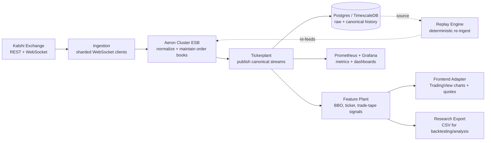
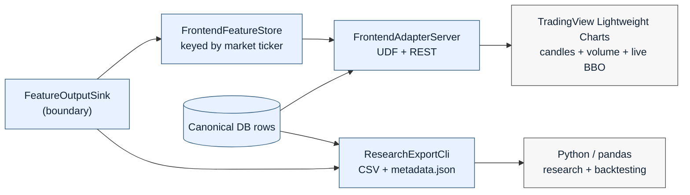

# Infrastructure for Automated Prediction-Markets Trading (Kalshi)

**IE 421 — High-Frequency Trading Technology · University of Illinois Urbana-Champaign · Spring 2026**
**Group 20**

Team: Jakob Bachhausen · Xuanli Wang · Amish Prasad · Iven Guzel
(Full bios, contact information, and links are at the end of this report.)

Primary repository: `github.com/shisuiki/group_08_project`

---

## 1. Executive Summary

Modern trading firms run on two things: a fast, reliable stream of *live* market data, and a clean archive of *historical* market data they can study afterward. Stock and crypto exchanges hand this to participants on a silver platter. **Prediction markets do not.**

[Kalshi](https://kalshi.com) is a U.S.-regulated exchange where people trade contracts on the outcome of real-world events — "Will it rain in Chicago tomorrow?", "Who wins this election?", "Will this film win Best Picture?". Each contract settles at $1 if the event happens and $0 if it doesn't, so its live price behaves like a continuously updated probability. It is a fascinating, fast-growing market — but it ships almost no robust historical data and no standard tooling for building automated strategies on top of it.

Our project builds the missing infrastructure: a **high-frequency-trading-grade data and tooling platform for Kalshi.** We take Kalshi's raw feed, normalize it into a clean internal format, distribute it to many downstream consumers in parallel with very low latency, store it durably so it can be replayed and studied, compute derived market signals from it, and surface all of that through a live charting frontend and a research-export pipeline.

We did not start from a blank page. We built on top of a Fall 2024 IE 421 project (Group 08) that had produced a proof-of-concept data-collection pipeline, and we extended it into a substantially more capable, deployable, and observable system — adding sharded ingestion, a redesigned stream-routing layer, durable database storage, deterministic replay, a feature-computation layer, latency instrumentation, continuous deployment to the cloud, and a frontend/research integration layer.

**Bottom line:** we turned a single-purpose data recorder into a modular, cloud-deployed platform that ingests live prediction-market data, distributes and stores it at HFT-grade latencies, and exposes it for visualization, research, and future strategy work.

---

## 2. Background: What Is a Prediction Market?

A prediction market lets people trade *binary event contracts*. Each contract resolves to one of two outcomes, "Yes" or "No", and pays out a fixed $1 to the correct side.

Because the payout is fixed at $1, the price of a contract is effectively the market's collective probability estimate of the event. If a contract trades at **$0.80**, the market is saying there's roughly an 80% chance the event happens. The opposing "No" side then trades near **$0.20** — and the two sides always sum to about $1.00. This is the elegant structural property that makes prediction markets both intuitive and analytically rich: prices *are* probabilities.

Kalshi runs a continuous limit-order-book exchange for these contracts, identical in mechanics to an equities exchange — there are bids, offers, a best bid/offer (BBO), depth at each price level, trades, and volume. The difference is purely in what the contracts represent. That means the *same* high-frequency trading machinery used for stocks — order books, feed handlers, tickerplants, low-latency messaging — applies directly to Kalshi. Demonstrating exactly that was the original insight behind this line of projects.

---

## 3. The Problem and Why It Matters

For a trading firm, an analyst, or a researcher, three problems stand in the way of working seriously with Kalshi:

1. **No robust historical data.** Kalshi's public API offers only limited historical coverage. Without a high-fidelity archive of past order-book activity, you cannot build trading strategies, run backtests, or do post-trade analysis.
2. **No standardized low-latency tooling.** There is no off-the-shelf tickerplant, feed handler, or research stack for Kalshi the way there is for major asset classes. Anyone wanting to operate at speed has to build the plumbing themselves.
3. **No clean separation between data and consumers.** Working directly against Kalshi's WebSocket API ties every tool you write to Kalshi's exact wire format and rate limits, and forces every consumer to duplicate connection, parsing, and book-maintenance logic.

This matters because prediction markets are growing quickly as a venue for both speculation and *hedging* against real-world risk, and because they are an unusually clean laboratory for market-microstructure research (the prices are literally probabilities). A solid, reusable, low-latency infrastructure layer is the foundation everything else — strategies, research, risk monitoring — has to sit on. That foundation is what we built.

---

## 4. What We Built — System Overview

At the highest level, market data makes a journey through our system: from Kalshi, into a normalization core, out to many consumers in parallel, and into durable storage and a frontend.



The design philosophy throughout is **clean layering**: each stage does one job, exposes a stable contract, and is unaware of the internals of the stages around it. A consumer reading our normalized "trade" stream does not know or care whether that data arrived live from Kalshi or was replayed from last week's archive — it looks identical. That single property is what makes the system usable for live operation, reproducible research, and backtesting *with the same code*.

The pipeline, narrated:

1. **Ingestion** connects to Kalshi over WebSocket (with REST used for market discovery and historical backfill). Subscriptions are *sharded* across multiple WebSocket clients so the system can follow a large universe of contracts at once.
2. The **Enterprise Service Bus (ESB)**, built on an Aeron Cluster, is the brain. It normalizes each raw Kalshi message into a clean **canonical event**, maintains a live order book per contract, and derives top-of-book updates.
3. The **Tickerplant** publishes those canonical events onto well-defined **external streams**, one logical stream per data type, so that many downstream consumers can subscribe simultaneously and all see identical data at the same time.
4. **Durable storage** writes both the exact raw input and the normalized canonical events into a Postgres/TimescaleDB database, giving us a queryable historical archive.
5. The **Feature Plant** consumes canonical streams (live or from the archive) and produces *derived features* — best-bid-offer summaries, ticker snapshots, a trade tape — on its own output channel.
6. The **Frontend & Research layer** (Plan 03) consumes those features and renders them as interactive price charts and live quote panels, and exports them as CSV for offline research and backtesting.
7. **Replay** can re-feed archived raw data back through the entire pipeline as if it were live, enabling deterministic end-to-end testing, profiling, and reproducible research.
8. **Observability** (Prometheus + Grafana) instruments the hot path with latency and data-quality metrics throughout.

---

## 5. Architecture Deep Dive (the technical version)

This section is written for readers who want to see how deep the system actually goes. The diagram below reflects the current codebase — every solid box is implemented and running.

```mermaid
flowchart LR
  classDef source fill:#fff4d6,stroke:#9a6b00,color:#1f1f1f;
  classDef current fill:#e7f1ff,stroke:#315b7c,color:#102033;
  classDef bus fill:#e8f7ee,stroke:#2d6a4f,color:#102033;
  classDef storage fill:#f5e8ff,stroke:#6d4c86,color:#102033;
  classDef external fill:#f7f7f7,stroke:#555,color:#102033;

  KALSHI["Kalshi API<br/>REST + WebSocket"]:::source

  subgraph Ingestion["Live Ingestion"]
    CFG["BackendConfig<br/>env-driven market selection,<br/>WS channels, cluster endpoints"]:::current
    KS["KalshiSystem<br/>configured or open-market capture,<br/>chunked subscriptions + WS sharding"]:::current
    KW["KalshiWrapper<br/>signed REST market discovery"]:::current
    KWS["KalshiWebSocketClient shards<br/>custom WS client,<br/>subscribe/update acknowledgements"]:::current
    ENV["KalshiIngressEnvelope<br/>raw payload + receive timestamp<br/>+ connection/replay metadata"]:::current
    CCO["ClientClusterOrchestrator<br/>Aeron Cluster ingress client"]:::bus
  end

  CFG --> KS
  KALSHI -->|REST markets| KW
  KS --> KW
  KW --> KWS
  KALSHI -->|WS market data| KWS
  KWS -->|enveloped raw JSON| ENV
  ENV --> CCO

  subgraph ESB["Aeron Cluster / ESB Runtime"]
    CM["ClusterMain<br/>MediaDriver + Archive +<br/>ConsensusModule, node0-node2"]:::bus
    ECS["ESBClusteredService<br/>leader handles ingress"]:::bus
    DP["DataProcessor<br/>normalization, publishing, metrics"]:::current
    PARSER["KalshiCanonicalParser<br/>raw -> canonical events"]:::current
    BOOK["OrderBookStateManager<br/>snapshot/delta state,<br/>derived top-of-book"]:::current
    PUB["AeronEventPublisher<br/>serializes canonical JSON"]:::bus
    TP["Tickerplant<br/>routes by stream_name<br/>via StreamRegistry"]:::current
  end

  CCO --> ECS
  CM --> ECS
  ECS --> DP
  DP --> PARSER
  DP --> BOOK
  DP --> PUB
  PUB --> TP

  subgraph Streams["External Aeron Streams (IDs 10-19)"]
    EXT["raw.kalshi.websocket,<br/>canonical.trade / ticker /<br/>orderbook.snapshot / orderbook.delta /<br/>open_interest, derived.top_of_book,<br/>system.parser_errors / sequence_gaps"]:::bus
  end

  TP --> EXT

  subgraph Storage["Durable Storage + Replay"]
    DBW["Async DB writer<br/>raw + canonical -> Postgres/Timescale"]:::storage
    DB[("TimescaleDB / Postgres")]:::storage
    REC["TickerplantStreamRecorder<br/>NDJSON capture (legacy/export)"]:::storage
    S3["S3 cold archive / export"]:::storage
    REPLAY["RawIngressReplayCli<br/>selects raw events from DB,<br/>re-injects to ingress"]:::current
  end

  EXT --> DBW
  DBW --> DB
  EXT -.-> REC
  REC -.-> S3
  DB --> REPLAY
  REPLAY -->|deterministic re-ingest| CCO

  subgraph Feature["Feature Plant"]
    FSRC["CanonicalEnvelopeSource<br/>(DB / recording / live Aeron)"]:::current
    FPSVC["FeaturePlantService<br/>poll + module dispatch + metrics"]:::current
    FMODS["Modules:<br/>feature.bbo, feature.ticker_snapshot,<br/>feature.trade_tape"]:::current
    FSINK["FeatureOutputSink boundary<br/>(stdout / bounded buffer / consumers)"]:::current
  end

  EXT -.-> FSRC
  DB --> FSRC
  FSRC --> FPSVC
  FPSVC --> FMODS
  FMODS --> FSINK

  subgraph Frontend["Frontend / Research (Plan 03)"]
    FADAPT["FrontendAdapterServer<br/>TradingView UDF + REST endpoints"]:::current
    FSTORE["FrontendFeatureStore<br/>in-memory, keyed by market,<br/>bar synthesis on read"]:::current
    CHART["TradingView Lightweight Charts<br/>static demo page"]:::external
    RX["ResearchExportCli<br/>per-feature CSV + metadata"]:::current
  end

  FSINK --> FSTORE
  DB --> FADAPT
  FSTORE --> FADAPT
  FADAPT --> CHART
  FSINK --> RX
  DB --> RX

  subgraph Obs["Observability + Delivery"]
    TAP["StreamTapServer<br/>/events /health /metrics"]:::current
    MON["Prometheus + Grafana"]:::external
    PROF["HotPathProfileCli<br/>synthetic profiling"]:::current
    CICD["GitHub Actions CI/CD<br/>exact-SHA EC2 deploy + rollback"]:::current
  end

  EXT --> TAP
  TAP --> MON
  DBW --> MON
```



### 5.1 Ingestion Layer

`KalshiSystem` orchestrates connectivity. It can run against a configured set of contract tickers, a series, or an "open-markets" discovery mode that finds the active universe via `KalshiWrapper` (a signed REST wrapper for Kalshi's market/trade/orderbook/series endpoints). Because Kalshi's WebSocket API authenticates through request headers in a way that off-the-shelf Java WebSocket libraries did not cleanly support, the original team wrote a **custom lightweight WebSocket client** (`KalshiWebSocketClient`); we carried this forward and **sharded** it, so subscriptions to a large universe are spread across multiple client connections rather than choking a single socket.

Every inbound message is wrapped in a `KalshiIngressEnvelope` carrying the exact raw payload, a receive timestamp, and connection/replay metadata, before being handed to the cluster ingress client (`ClientClusterOrchestrator`). This envelope is the seam that makes replay possible: replayed data enters through the *same* envelope path as live data, distinguished only by a `replay_id`.

### 5.2 The ESB: Aeron Cluster

The core is an **Enterprise Service Bus built on [Aeron](https://github.com/real-logic/aeron) Cluster**, a low-latency messaging system that uses the **Raft consensus algorithm** for leader election, fault tolerance, and replication. We chose Aeron specifically for its latency characteristics and its publish/subscribe model: services communicate over Aeron channels without having to manage the underlying transport or cluster-leadership details, which are abstracted behind an orchestrator. The cluster runs as a multi-node configuration (`node0`–`node2`), with the leader handling ingress.

> **A note on honesty about latency.** Aeron is engineered for sub-100-microsecond messaging, and we keep the live path latency-first by design. We deliberately do *not* claim a verified bounded end-to-end production latency number, because our current profiling and CI evidence does not rigorously establish one. We built the *instrumentation* to measure it (see §5.8); turning those measurements into a defensible figure is characterized future work, not a result we will overstate.

### 5.3 Data Processor and Canonical Normalization

`DataProcessor` is where raw Kalshi messages become clean, typed, internal events. `KalshiCanonicalParser` translates each raw message into a **canonical event** with a stable schema, and `OrderBookStateManager` maintains a live order book per contract from snapshot and delta messages, deriving a **top-of-book** event whenever the best bid/offer changes.

Two engineering decisions here are worth highlighting:

- **Canonical normalization decouples every downstream consumer from Kalshi's wire format.** If Kalshi changes its API (as it did between Fall 2024 and now — a change we had to absorb), only the parser changes; every consumer keeps working. Each event carries a `schema_version`, `event_id`, `event_type`, `stream_name`, and a rich `metadata` block (source, source sequence, market ticker/id, ingest and publish timestamps, raw-event id, replay id).
- **Fixed-point pricing.** Prices are represented as integer "micros" — `*_price_micros` scaled by 1,000,000, where `1,000,000` equals $1.00 of probability — rather than floating-point dollars. This avoids floating-point rounding error accumulating across millions of events, which matters enormously for financial data where a fraction of a cent compounds into incorrect P&L and broken invariants (recall that Yes + No should sum to $1.00).

### 5.4 Tickerplant and the Stream Registry

The `Tickerplant` receives canonical events on the internal bus and republishes them to **external Aeron streams**, with one logical stream per data type. A key improvement over the legacy design: routing is done by **`stream_name` through a `StreamRegistry`**, not by hardcoded byte offsets or message-type characters as in the original proof of concept. The registry assigns stable protocol stream IDs (10–19 for external streams, 20 for the internal bus):

| Stream | ID | Contents |
| --- | ---: | --- |
| `raw.kalshi.websocket` | 10 | exact inbound WebSocket payloads |
| `canonical.trade` | 11 | normalized trades |
| `canonical.orderbook.snapshot` | 12 | full book snapshots |
| `canonical.orderbook.delta` | 13 | incremental book updates |
| `canonical.ticker` | 14 | ticker summaries |
| `canonical.open_interest` | 15 | open-interest updates |
| `derived.top_of_book` | 16 | derived BBO |
| `canonical.market_lifecycle` | 17 | market state changes |
| `system.parser_errors` | 18 | parser error events |
| `system.sequence_gaps` | 19 | detected source sequence gaps |

This registry-driven approach makes the system **extensible**: adding a new stream type is a registry entry plus a producer, not a surgery on hardcoded offsets. All external payloads remain canonical JSON tagged with their `stream_name`, so no consumer depends on a fixed binary layout.

### 5.5 Durable Storage (DB-Primary)

The original system wrote trades one-at-a-time to AWS Redshift — a known bottleneck the prior team flagged as future work. We **removed Redshift from the live path** and moved to a **database-primary** model: an asynchronous, best-effort writer persists both raw WebSocket input and canonical events into **Postgres/TimescaleDB**. Drops and disabled states are observable through metrics (`processor_db_offers_total`, `db_*`), so the storage path is never a silent failure point. A local TimescaleDB Docker profile and a migration runner make the database reproducible for local smoke tests.

NDJSON file recording and S3 sync are retained, but **repositioned** as explicit *capture, archive, import, and export* paths — useful for recorder soaks, fixtures, demo data, and cold archival — rather than as the live source of truth. This split-by-purpose storage design lets the hot path stay fast and queryable while preserving exact-fidelity raw capture when it's needed.

### 5.6 Recording and Replay

Recording happens at two points: at **ingestion** (`RawIngestRecorder`, exact inbound payloads) and at the **consumer side** (`TickerplantStreamRecorder`, the normalized streams as any Aeron client observes them). Capturing both lets us validate that what consumers receive matches what was ingested, and detect drift.

`RawIngressReplayCli` selects archived raw events (from TimescaleDB by default, or local NDJSON for fixtures) and **re-injects them through the ingress path** as if they were live, attaching a `replay_id`. Because replay enters the same envelope path as live data, the entire downstream pipeline — normalization, book maintenance, tickerplant, consumers — processes replayed data identically to live data. This is the foundation for **deterministic end-to-end testing, hot-path profiling, and reproducible research/backtesting.**

### 5.7 Feature Plant

The **Feature Plant** is a downstream layer that turns raw normalized market data into *derived signals*. It is deliberately built around one abstraction, the `CanonicalEnvelopeSource`, which can be backed by **live Aeron streams, the database, or file recordings interchangeably** — so the exact same feature code runs in production, in replay, and in research.

`FeaturePlantService` polls a source, dispatches each event to registered feature modules, and emits results to a `FeatureOutputSink`. The current modules are:

- `feature.bbo` — best-bid/offer with derived spread and midpoint, from `derived.top_of_book`
- `feature.ticker_snapshot` — latest ticker state, from `canonical.ticker`
- `feature.trade_tape` — the running trade tape, from `canonical.trade`

The critical architectural rule, enforced by an operational runbook, is that **downstream visualization, backtesting, and research-export modules must attach to the `FeatureOutputSink` boundary — never to raw tickerplant streams directly.** This keeps the consumer side cleanly separated from the data path and means improvements to feature computation propagate to every consumer without changing the consumers.

### 5.8 Frontend and Research Integration (Plan 03)

This layer is the consumer side of the Feature Plant — what makes the platform *usable* by humans and research tools. It comprises three components, all of which respect the `FeatureOutputSink` boundary above.

**Research Export CLI (`ResearchExportCli` + `CsvFeatureExportSink`).** A batch exporter that drives a `FeaturePlantService` over historical data (canonical DB rows by default, or recordings) and writes **one CSV file per feature stream**, with the column header derived from the feature's value schema, plus a `metadata.json` summarizing the run (time window, markets, streams, modules, row counts). It supports market-ticker and time-window filtering applied at the sink. The output is designed to drop directly into a Python/pandas research or backtesting workflow.

**Frontend Datafeed Adapter (`FrontendAdapterServer`).** A long-running HTTP service that accumulates feature outputs into an in-memory store (`FrontendFeatureStore`) keyed by market ticker and exposes them through two complementary interfaces:

- The **TradingView UDF datafeed protocol** (`/datafeed/config`, `/datafeed/symbols`, `/datafeed/search`, `/datafeed/history`, `/datafeed/time`), so any standard charting client can consume our data.
- **Companion REST endpoints** (`/symbols`, `/quotes`, `/health`, `/metrics`) for live quote panels and operational monitoring.

A deliberate design choice: **OHLC candlestick bars are synthesized on read** from `feature.bbo` midpoints, at any requested resolution (1s, 5s, 30s, 1m, 5m, 15m, 1h), rather than precomputed and stored. Bars are a *view* over the feature buffer, not a baked-in feature — so the bar logic can evolve independently, and when a dedicated bar/bucket feature module lands (planned), the adapter switches its source without changing its external API. The adapter runs against live, replayed, or database-backed sources through the same interface.

**TradingView Lightweight Charts demo page.** A static, build-step-free HTML/JS frontend that loads the open-source TradingView Lightweight Charts library, populates its symbol and resolution controls from the adapter's UDF endpoints, renders candlestick + volume series from `/datafeed/history`, and shows a live BBO panel polled from `/quotes`. This is the project's primary visual surface — the thing a human actually looks at.



This component shipped as the repository's first reviewed pull request, including unit and integration tests (`CsvFeatureExportSinkTest`, `FrontendFeatureStoreTest`, `BarSynthesisTest`, `UdfEndpointsTest`), runbooks for both Java modules, and a Docker Compose service definition.

### 5.9 Observability and Continuous Delivery

The system is instrumented throughout. `BackendMetrics` and per-module metrics feed a `StreamTapServer` (which exposes `/events`, `/health`, and `/metrics`), scraped by **Prometheus** and visualized in **Grafana** dashboards. A `HotPathProfileCli` runs synthetic profiling of the parser, order-book, and processing stages to support the latency-optimization work that the instrumentation enables.

Delivery is automated: **GitHub Actions** runs CI compose gates and deploys to an **Amazon EC2** instance, using exact-commit-SHA deploys, a candidate prebuild step, last-successful-deploy rollback state, and post-deploy smoke checks. The deployed instance runs against live Kalshi data with credentials configured server-side. This is what lets the team work against one shared, always-current deployment rather than each member duplicating a full local stack.

---

## 6. Implementation Status (honest current-vs-planned)

We are deliberately precise about what is *running today* versus what is *designed but not yet shipped*. Overclaiming would be both dishonest and easy to catch.

| Capability | Status | Boundary / notes |
| --- | --- | --- |
| Live WebSocket ingestion (sharded) | **current** | Configured or discovered markets; reconnect/subscription-restore hardening remains planned. |
| Aeron Cluster / tickerplant streams | **current** | Cluster ingress, processor, registry-based routing, external streams all exist; cluster recovery restores watermarks and paused-book checkpoints, not full book depth. |
| Canonical normalization + schema versioning | **current** | Parser, order-book state, derived top-of-book, fixed-point pricing. |
| DB-primary raw/canonical storage | **current** | Async best-effort writer to Timescale/Postgres; drops observable via metrics. |
| Historical REST backfill | **current (basic)** | DB targets exist; retry taxonomy and operational hardening limited. |
| Feature Plant modules | **current (basic)** | BBO, ticker snapshot, trade tape from DB / recording / live sources; richer stateful/versioned feature streams planned. |
| Persistent feature-output demo path | **current (demo)** | Schema/store, explicit DB output, seed + smoke script, frontend snapshot mode; async/batched production persistence planned. |
| Frontend adapter + static chart (Plan 03) | **current (demo)** | HTTP-polling adapter, market metadata search/catalog, TradingView chart; no production realtime WS/SSE frontend or replay UI controls. |
| Research export (Plan 03) | **current** | Per-feature CSV + metadata from DB or recording sources. |
| Raw replay | **current (basic)** | DB source default; local NDJSON is import/debug fallback; republishes raw ingress envelopes. |
| Recording capture / S3 archive | **legacy / capture path** | Explicit capture/archive/import/export, not the live source of truth. |
| Observability (metrics, Prometheus, Grafana, profiler, CI/CD) | **current (basic)** | Backend/feature/streamtap metrics, dashboards, exact-SHA EC2 deploy + rollback + smoke checks; dependency scanning, alert rules, tracing planned. |
| Latency optimization of hot path | **planned** | Instrumentation exists; characterized optimization is future work. |
| Pricing model | **planned** | Not present as a shipped runtime feature. |
| Arbitrage scanner | **planned** | Not present as a shipped runtime feature. |
| Semantic matching / ontology / synthetic combo contracts | **planned** | Designed (see §8); not implemented in source today. |
| Durable query/export API | **planned** | Basic HTTP inspection endpoints exist; production durable API not present. |
| Redshift / old warehouse | **removed** | Legacy diagram artifact only; storage is DB-primary plus capture paths. |

---

## 7. Key Engineering Decisions and Tradeoffs

A short tour of the choices we are most willing to defend in front of an expert:

- **Build on a prior project rather than from scratch.** Per the course's explicit preference, we extended Fall 2024's Group 08 proof of concept. The cost was absorbing an undocumented codebase and a since-changed Kalshi API; the benefit was starting from a working Aeron/tickerplant skeleton and spending our effort on capability rather than re-deriving the basics.
- **Canonical normalization with schema versioning.** Decouples every consumer from Kalshi's wire format and from each other. This paid off immediately when the Kalshi API schema changed — the blast radius was one parser, not the whole system.
- **Integer fixed-point pricing (`micros`, 1e6 = $1.00).** Eliminates floating-point drift in a domain where prices are probabilities that must respect hard invariants.
- **Routing by `stream_name` via a registry, not byte offsets.** Trades a tiny amount of payload size for extensibility and the elimination of an entire class of brittle, offset-dependent bugs.
- **One source abstraction for live, DB, and recording (`CanonicalEnvelopeSource`).** The same feature and consumer code runs in production, replay, and research. This is the single most important property for making the system useful for backtesting without code duplication or lookahead-bias risk.
- **The `FeatureOutputSink` consumer boundary.** Visualization, research export, and future backtesting attach here and never touch raw streams. (An earlier attempt that wired a frontend directly into raw streams was deliberately removed for exactly this reason — it coupled the UI to the data path and made the code hard to reason about.)
- **Bars synthesized on read, not stored.** Keeps bar logic out of the feature modules until a dedicated bar module is warranted, and keeps the frontend's external API stable across that future change.
- **DB-primary storage replacing per-row Redshift writes.** Trades the simplicity of "dump everything to a warehouse" for a queryable, low-latency, observable store appropriate for both live operation and research reads.
- **Recording at two points (pre- and post-normalization).** Enables both exact replay and consumer-side validation/data-quality checking.
- **Aeron + Raft for the bus.** Low-latency pub/sub with fault tolerance and a clean path to multicast delivery when deployed on Linux/Kubernetes.

A development-process note, in the spirit of the course's guidance on modern tooling: much of the implementation was accelerated with agentic coding tools, used deliberately — for scaffolding and per-component generation — with human-owned architecture, code review, integration, and testing. This was a conscious methodology, and it is also why disciplined cleanup passes and a careful current-vs-planned audit (this document) were a necessary part of the work rather than an afterthought.

---

## 8. Future Work

The architecture was designed with clear extension points, several of which are fully specified and waiting on implementation:

- **Hot-path latency optimization**, turning the existing instrumentation into measured, defensible P50/P99 figures and then driving them down (binary serialization experiments — SBE/FlatBuffers/Agrona buffers — are scoped here).
- **Production feature platform**: versioned `feature.*` output streams, a `MarketStateStore`, richer stateful modules (spread/depth summaries, OI deltas), bar/bucket modules, and a durable feature/query API behind the existing boundary.
- **Frontend hardening**: a realtime WebSocket/SSE push frontend (replacing demo polling) and replay viewer controls (pause/resume/seek/speed).
- **Backend reliability**: WebSocket heartbeat/reconnect with connection-health metrics, full order-book recovery after sequence gaps, and cluster snapshot/restore.
- **Semantic / pricing / arbitrage layer** (the most research-ambitious direction): an LLM-assisted parser that reads contract terms into a structured `SemanticContract` schema, an ontology linking related contracts, a constraint engine identifying set/Markovian relationships between Kalshi markets, a synthetic-combo-contract engine that prices contracts that don't natively exist by propagating prices through those relationships, and an execution-aware arbitrage scanner. This consumes the feature streams, market metadata, replay, and data-quality signals already in place.
- **Capacity / queueing analysis**: characterizing how many WebSocket subscriptions and downstream normalized streams the system can sustain under bandwidth and compute constraints while meeting latency targets — a direct application of queueing theory to the sharding-and-fan-out design.
- **Observability completion**: data-quality event stream, OpenTelemetry tracing, and a full Grafana alert-rule set with runbooks.

---

## 9. How to Run

```bash
# 1. Configure
cp .env.example .env
# For live ingestion, set KALSHI_KEY_ID, KALSHI_KEY_HOST_PATH, and one of:
#   KALSHI_MARKET_TICKERS, KALSHI_MARKET_SERIES_TICKER, or
#   KALSHI_MARKET_SELECTION_MODE=open_markets

# 2. Bring up the live cluster (three-node stack + WS client + streamtap)
docker compose --profile cluster-live up --build
#   (single-node-local profile available for a quick local smoke check)

# 3. Local database smoke test
docker compose --profile local-db up -d timescaledb
docker compose --profile local-db run --rm db-migrate

# 4. Feature Plant (defaults to canonical DB rows; recording mode optional)
#   set FEATUREPLANT_DB_URL or DB_WRITER_DATABASE_URL
#   FEATUREPLANT_SOURCE=recording for legacy/demo recording runs

# 5. Frontend adapter (defaults to canonical DB rows)
#   set FRONTEND_ADAPTER_DB_URL or DB_WRITER_DATABASE_URL
#   then open the TradingView Lightweight Charts demo page against it

# 6. Research export (defaults to canonical DB rows)
#   set RESEARCH_EXPORT_DB_URL or DB_WRITER_DATABASE_URL
#   --source=recording for explicit recording/debug runs

# 7. Observability only
docker compose --profile observability up --build   # Prometheus + Grafana + streamtap

# 8. Replay (deterministic re-ingest; DB source by default)
#   RAW_REPLAY_SOURCE=local-ndjson for fixture/import/debug mode
```

Host-published admin, data, metrics, DB, Aeron, and cluster ports default to loopback (`COMPOSE_HOST_BIND_IP=127.0.0.1`). Override only behind a firewall, authenticated reverse proxy, or isolated network. Full stream contracts, schema mappings, replay behavior, feature-plant behavior, and operational notes are documented under `docs/`.

---

## 10. Team

**Xuanli Wang — Project Lead, Backend & Infrastructure.**
Led the bulk of the implementation: modernizing the legacy codebase against the current Kalshi API, the Aeron Cluster / ESB and tickerplant work, WebSocket sharding, recording/replay, the Feature Plant, DB-primary storage, latency instrumentation, and the EC2 + GitHub Actions continuous-deployment pipeline.
GitHub: [@shisuiki](https://github.com/shisuiki) · Email: xuanliw2@illinois.edu · LinkedIn: *[add]*

**Jakob Bachhausen — Project Origination & Coordination.**
Originated the project direction, authored the initial proposal, identified Group 08's work as the foundation to build on, and led team coordination and visualization direction throughout.
GitHub: [@Yakobbb](https://github.com/Yakobbb) · Email: jakobjb2@illinois.edu · LinkedIn: *[add]*

**Amish Prasad — Frontend & Research Integration (Plan 03).**
Built the consumer side of the Feature Plant: the research-export CLI, the frontend datafeed adapter implementing the TradingView UDF protocol, and the TradingView Lightweight Charts demo page — all attaching to the `FeatureOutputSink` boundary, with accompanying tests and runbooks.
GitHub: [@sudo111](https://github.com/sudo111) · Email: amishp2@illinois.edu · LinkedIn: *[add]*

**Iven Guzel — Analysis & Queueing Theory.**
Contributed queueing-theory perspective on the system's capacity and fan-out characteristics (subscription and downstream-stream limits under bandwidth/compute constraints).
GitHub: [@ivenguzel](https://github.com/ivenguzel) · Email: iguzel2@illinois.edu · LinkedIn: *[add]*

---

*Built for IE 421, Spring 2026, University of Illinois Urbana-Champaign. With thanks to Prof. David Lariviere, and to the Fall 2024 Group 08 team whose proof-of-concept pipeline this work extends.*
